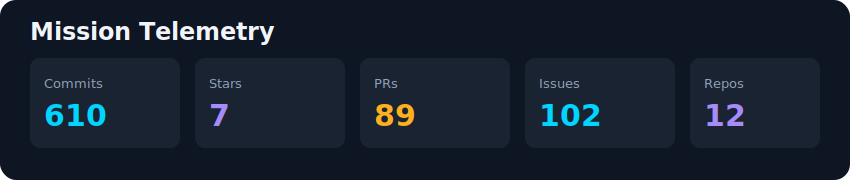
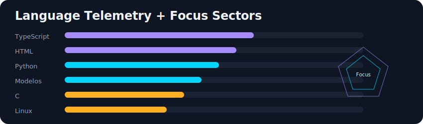
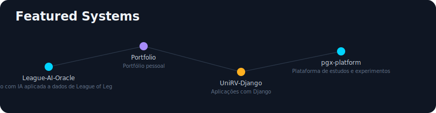

# João Paulo G. Santos

<!-- markdownlint-disable MD013 -->

Estudante de Engenharia de Software (UniRV), com foco em desenvolvimento web, IA aplicada e projetos práticos.

## 🚀 Telemetria

## 🛠 Stack & foco

- **Core:** TypeScript, HTML/CSS, Git e Linux
- **Foco atual:** IA aplicada, automações e arquitetura de sistemas

## ✨ Projetos

- 🤖 **League-AI-Oracle** — [repositório](https://github.com/JPClow3/League-AI-Oracle)
- 🌐 **Portfolio** — [repositório](https://github.com/JPClow3/Portfolio)
- 🐍 **UniRV-Django** — [repositório](https://github.com/JPClow3/UniRV-Django)
- ⚙️ **pgx-platform** — [repositório](https://github.com/JPClow3/pgx-platform)

## 💬 Sobre

- Construindo base sólida para atuar como desenvolvedor de software.
- Interesse em front-end, IA e soluções com impacto real.
- Aberto a colaborações em projetos acadêmicos e open source.

## 🔗 Contato

## 🪐 Galaxy Profile no README (implementado aqui)

## Contribuição

Se quiser contribuir com melhorias neste perfil, veja
[CONTRIBUTING.md](CONTRIBUTING.md) e
[CODE_OF_CONDUCT.md](CODE_OF_CONDUCT.md).

Template reutilizável para outros repositórios:
[README_TEMPLATE.md](README_TEMPLATE.md).

## Licença

Este repositório está licenciado sob a licença MIT.
Veja [LICENSE](LICENSE).

<!-- markdownlint-enable MD013 -->
