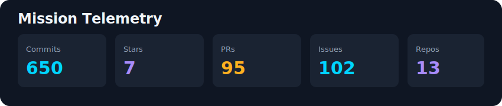
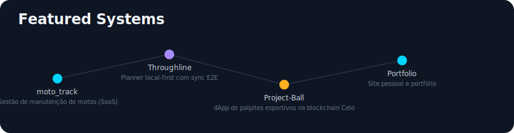

# João Paulo G. Santos

<!-- markdownlint-disable MD013 -->

Estudante de Engenharia de Software (UniRV), com foco em desenvolvimento web, IA aplicada e projetos práticos.

## 🚀 Telemetria

## 🛠 Stack & foco

- **Core:** TypeScript, HTML/CSS, Git e Linux
- **Foco atual:** IA aplicada, automações e arquitetura de sistemas

## ✨ Projetos

- 🤖 **League-AI-Oracle** — [repositório](https://github.com/JPClow3/League-AI-Oracle)
- 🌐 **Portfolio** — [repositório](https://github.com/JPClow3/Portfolio)
- 🐍 **UniRV-Django** — [repositório](https://github.com/JPClow3/UniRV-Django)
- ⚙️ **pgx-platform** — [repositório](https://github.com/JPClow3/pgx-platform)

<!--START_SECTION:activity-->
1. ❌ Merged PR [#1](undefined) in [JPClow3/Project-Ball](https://github.com/JPClow3/Project-Ball)
2. 💪 Opened PR [#1](undefined) in [JPClow3/Project-Ball](https://github.com/JPClow3/Project-Ball)
3. ❌ Closed PR [#48](undefined) in [JPClow3/Portfolio](https://github.com/JPClow3/Portfolio)
4. ❌ Closed PR [#49](undefined) in [JPClow3/Portfolio](https://github.com/JPClow3/Portfolio)
5. ❌ Closed PR [#50](undefined) in [JPClow3/Portfolio](https://github.com/JPClow3/Portfolio)
6. ❌ Closed PR [#51](undefined) in [JPClow3/Portfolio](https://github.com/JPClow3/Portfolio)
7. ❌ Closed PR [#52](undefined) in [JPClow3/Portfolio](https://github.com/JPClow3/Portfolio)
8. ❌ Merged PR [#8](undefined) in [JPClow3/moto_track](https://github.com/JPClow3/moto_track)
9. 💪 Opened PR [#8](undefined) in [JPClow3/moto_track](https://github.com/JPClow3/moto_track)
10. ❌ Merged PR [#6](undefined) in [JPClow3/moto_track](https://github.com/JPClow3/moto_track)
<!--END_SECTION:activity-->

## 💬 Sobre

- Construindo base sólida para atuar como desenvolvedor de software.
- Interesse em front-end, IA e soluções com impacto real.
- Aberto a colaborações em projetos acadêmicos e open source.

## 🔗 Contato

<!-- markdownlint-enable MD013 -->
