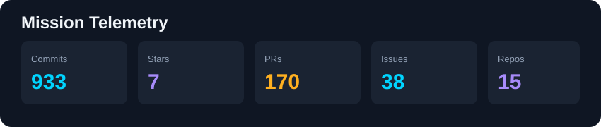
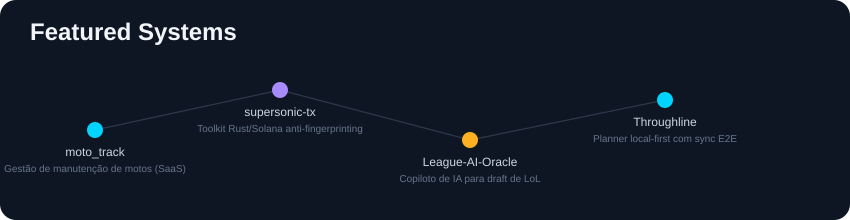

# João Paulo G. Santos

<!-- markdownlint-disable MD013 -->

Estudante de Engenharia de Software (UniRV), com foco em desenvolvimento web, IA aplicada e projetos práticos.

## 🚀 Telemetria

## 🛠 Stack & foco

- **Core:** TypeScript, React, Svelte, Astro, Tailwind CSS
- **Foco atual:** produtos full-stack (Supabase, Cloudflare, Docker), automações e experimentação com Web3 (Solidity, Solana/Rust)

## ✨ Projetos

- 🏍️ **moto_track** — SaaS de gestão de manutenção de motos (SvelteKit + Supabase + Cloudflare) — [repositório](https://github.com/JPClow3/moto_track)
- ⚡ **supersonic-tx** — toolkit em Rust que ofusca transferências Solana com ruído comportamental realista (Anchor + Solana) — [repositório](https://github.com/JPClow3/supersonic-tx)
- 🧠 **League-AI-Oracle** — copiloto estratégico de IA para draft de League of Legends (React + Gemini API) — [repositório](https://github.com/JPClow3/League-AI-Oracle)
- 🧭 **Throughline** — planner local-first com sync criptografado ponta a ponta (React + IndexedDB) — [repositório](https://github.com/JPClow3/Throughline)
- 🌐 **Portfolio** — site pessoal e portfólio (React/Astro + GSAP) — [repositório](https://github.com/JPClow3/Portfolio) · [live](https://jpclow.dev)

<!--START_SECTION:activity-->
1. ❌ Merged PR [#1](undefined) in [JPClow3/ai-dev-controller](https://github.com/JPClow3/ai-dev-controller)
2. 💪 Opened PR [#1](undefined) in [JPClow3/ai-dev-controller](https://github.com/JPClow3/ai-dev-controller)
3. ❌ Merged PR [#14](undefined) in [JPClow3/JPClow3](https://github.com/JPClow3/JPClow3)
4. 🗣 Commented on [#14](https://github.com/JPClow3/JPClow3/pull/14#issuecomment-5207223934) in [JPClow3/JPClow3](https://github.com/JPClow3/JPClow3)
5. 💪 Opened PR [#14](undefined) in [JPClow3/JPClow3](https://github.com/JPClow3/JPClow3)
6. ❌ Merged PR [#20](undefined) in [JPClow3/moto_track](https://github.com/JPClow3/moto_track)
7. 💪 Opened PR [#20](undefined) in [JPClow3/moto_track](https://github.com/JPClow3/moto_track)
8. ❌ Merged PR [#19](undefined) in [JPClow3/moto_track](https://github.com/JPClow3/moto_track)
9. 💪 Opened PR [#19](undefined) in [JPClow3/moto_track](https://github.com/JPClow3/moto_track)
10. ❌ Closed PR [#15](undefined) in [JPClow3/moto_track](https://github.com/JPClow3/moto_track)
<!--END_SECTION:activity-->

## 🐍 Contribution Snake

## 💬 Sobre

- Construindo base sólida para atuar como desenvolvedor de software.
- Interesse em produtos full-stack, automação e experimentação com Web3.
- Aberto a colaborações em projetos acadêmicos e open source.

## 🔗 Contato

<!-- markdownlint-enable MD013 -->
