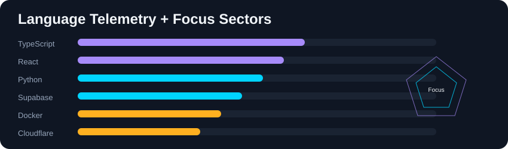

# João Paulo Gonçalves Santos

Full-stack product engineer in Brazil. I build web apps, automation, data systems, and AI products—from discovery through deployment. Available for freelance work.

## 🚀 Telemetry

## What I build

- Operational web apps and SaaS workflows
- Data systems, automation, and integrations
- AI products with practical interfaces and reliable delivery

## Current toolkit

TypeScript · SvelteKit · Astro · React · Python · Cloudflare · Neon · PostgreSQL · Docker · PWAs · IndexedDB · geospatial and AI workflows

## Selected work

- 🏍️ **[Moto Track](https://github.com/JPClow3/moto_track)** — SvelteKit motorcycle operations platform for fuel, maintenance, documents, costs, professional shifts, and profitability, backed by Neon and Cloudflare.
- 🧭 **[Throughline](https://github.com/JPClow3/Throughline)** — local-first planner with offline PWA behavior and end-to-end encrypted sync.
- 🤖 **[AI Dev Controller](https://github.com/JPClow3/ai-dev-controller)** — deterministic controller for GitHub/Linear workflows and AI-assisted engineering automation.
- 📡 **[DBS Telecom](https://github.com/JPClow3/dbs-telecom)** — customer and operations tools with Expo, Neon, Gemini, and Cloudflare Workers.
- 🌐 **[Developer Portfolio](https://github.com/JPClow3/Portfolio)** — Astro/Svelte/TypeScript portfolio deployed on Cloudflare Pages · [live site](https://jpclow.dev)

## About

I care about clear product boundaries, resilient data flows, accessible interfaces, and shipping the whole path from discovery to deployment. I share selected experiments and client-facing work here as they become ready.

## 🐍 Contribution Snake

